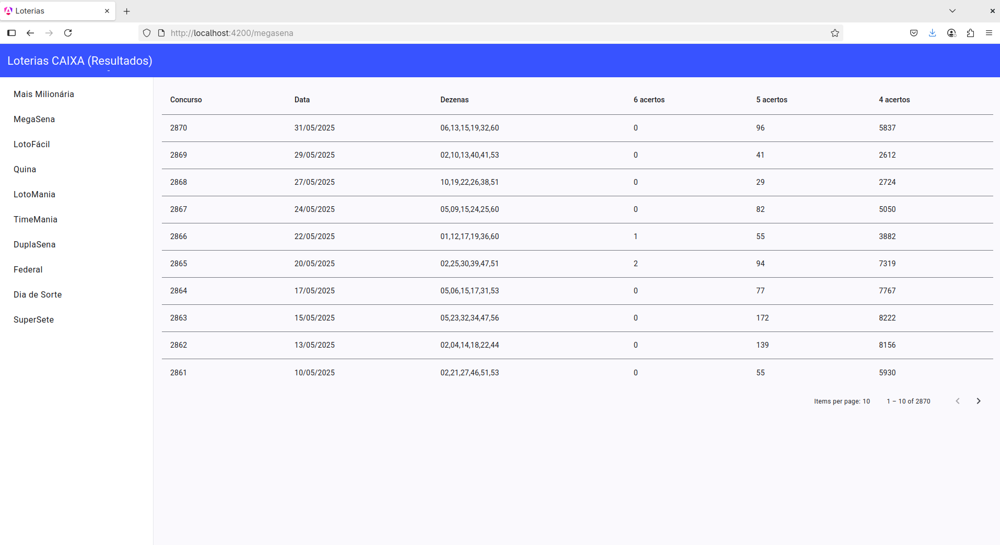

# Loterias

Aplicação desenvolvida com Angular que exibe os resultados de 10 loterias
brasileiras, utilizando para isso a API [Loterias API](https://loteriascaixa-api.herokuapp.com).




## Como executar

```bash
npm install
ng serve
```